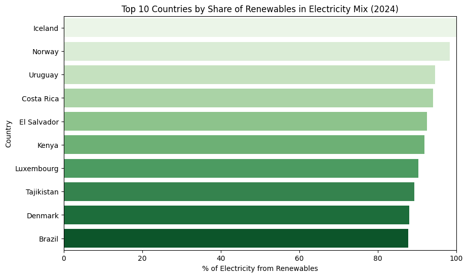
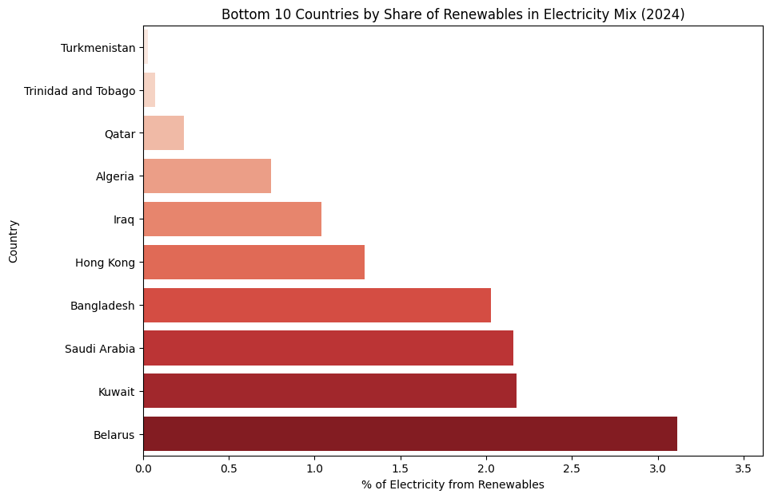

# Renewable Energy Share Analysis (2024)

This project analyzes the share of renewable energy in the electricity mix of countries using Python, Pandas, and Seaborn.

## Project Overview
- Data cleaning and preparation using Pandas
- Visualizing the "Top 10" and "Bottom 10" countries by renewable energy share
- Insights into global renewable energy adoption

## Tools Used
- Python
- Pandas
- Seaborn
- Matplotlib
- Google Colab

## Results

## Files in This Repo
- `renewable_energy_analysis.ipynb` — the main analysis notebook
- `README.md` — project description

## Data Source
[https://raw.githubusercontent.com/owid/energy-data/master/owid-energy-data.csv] 
